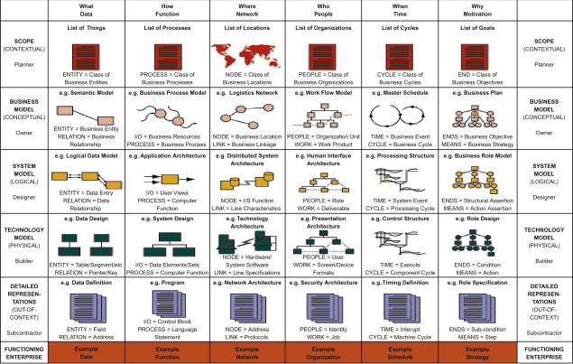
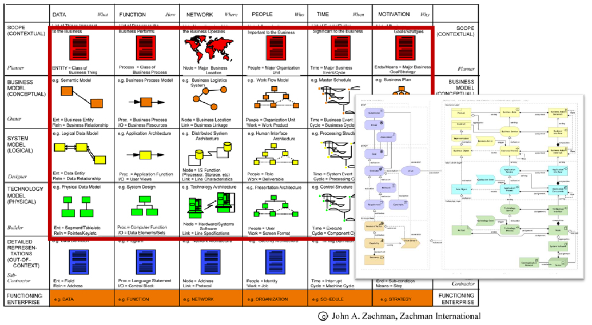
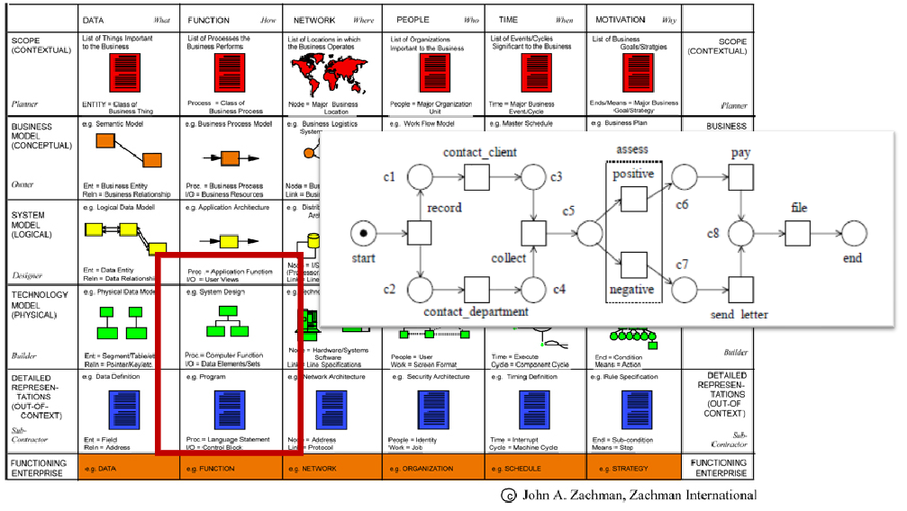
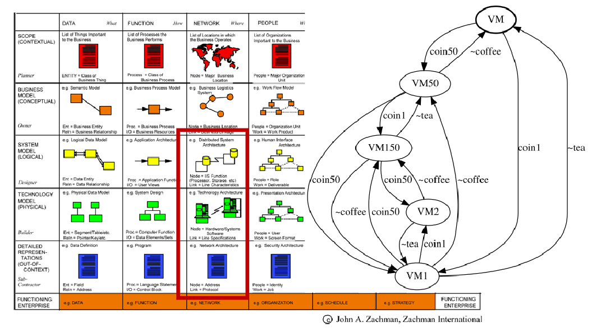
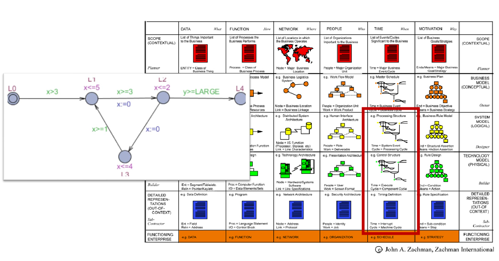
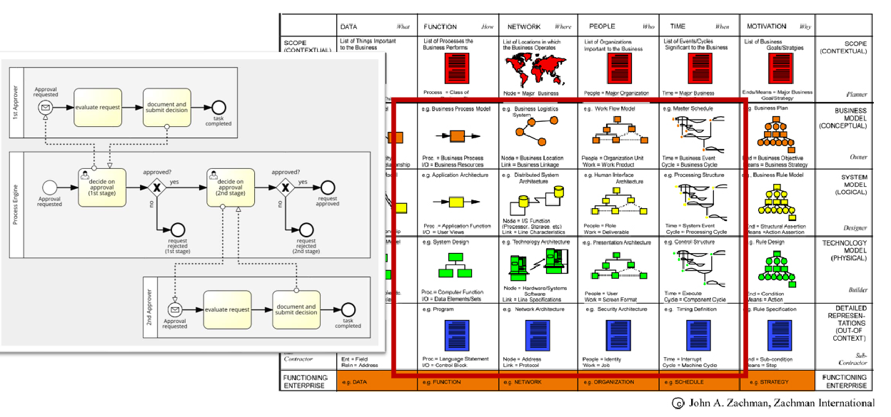
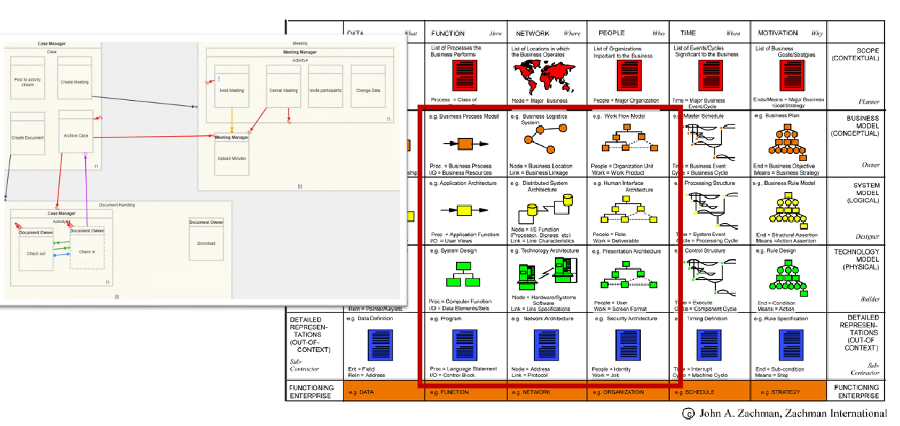

<link href="./../styles.css" rel="stylesheet"></link>
Week 01 : Introduction

- [Enterprise Architectures (EA)](#enterprise-architectures-ea)
- [Zachman Framework](#zachman-framework)
  - [Structure](#structure)
  - [Examples](#examples)
- [ArchiMate](#archimate)
- [Petri Nets](#petri-nets)
- [CCS and Pi-calculus](#ccs-and-pi-calculus)
- [Timed Automata](#timed-automata)
- [Timed Automata](#timed-automata-1)
- [DCR Graphs](#dcr-graphs)
- [DMN](#dmn)
- [I-star](#i-star)

### Modelling for Software Development
We rely on software models due to four facts:
1. Software are complex and needs to be discussed in different levels of abstraction (depending on actor, phase and objectives)
2. It is a big part of our lives and is constantly changing
3. There is a shortage of software development skills
4. You need to be able to communicate your system

### The use of models in Software Engineering
**Models as sketches**: 
- for communication of selected parts of the system
- only partial views of the system are given
- E.g.: UML class and sequence diagrams
- Use languages: I-star, Automata, CCS and Pi calculus, Petri Nets, Timed Automata and Archimate

**Models as blueprints**: 
- provides complete and detailed overview of a system 
- used to specify system behavior / as representations of existing
implementations in a system
- Use languages: BPMN, DCR graphs

**Models as programs**: 
- Simplified behavior specifications that can show systems in different scenarios
- a low-code approach to system implementation
- - Use languages: BPMN, DCR graphs and DMN

### System Integration Definition
Def. 1: "The process of bringing together the component subsystems into one system (an aggregation of subsystems cooperating so that the system is able to deliver the overarching functionality) and ensuring that the subsystems function together as a system".

Def. 2: "The process of linking together different computing systems and software applications physically or functionally to act as a coordinated whole".

## Enterprise Architectures (EA)
Enterprise architecture (EA) is a well-defined practice for conducting enterprise analysis, design, planning, and implementation, using a holistic approach at all times, for the successful development and execution of strategy. Enterprise architecture applies architecture principles and practices to guide organizations through the business, information, process, and technology changes necessary to execute their strategies. These practices utilize the various aspects of an enterprise to identify, motivate, and achieve these changes.

Brigdes strategy and implementation
| Business strategy | **Architecture**              | Implementation |
| :---------------- | :--------------               | :---- |
| Business drivers  | **Business architecture**     | Business processes |
| Business goals    | **Information architecture**  | Application systems |
| Business policy   | **Solution architecture**     | Tech infrastructure |
| Trend Analysis    | **Technology architecture**   | Organizational structure |

**Why?**:
- Overview of the whole system
- Look beyond restricted views
- See the context

## Zachman Framework
The framework's primary goal is to provide a systematic approach to organizing and managing the complexity inherent in information technology (IT) and business architectures.

### Structure
The Zachman Framework is organized around two dimensions: six interrogatives (What, How, Where, Who, When, Why) and six perspectives (Contextual, Conceptual, Logical, Physical, Detailed, and Operational). Each cell in the framework combines a perspective with an interrogative to help define a specific aspect of the enterprise architecture.

**Interrogatives (Communication Questions)**:
* What: Information about the enterprise's data or the materials used.
* How: Information on the systems or processes within the organization.
* Where: Information on the distribution or geographical aspects.
* Who: Information about the people or organizational units involved.
* When: Information related to the timing of business processes.
* Why: Information on the motivations, goals, and objectives.

**Perspectives (Stakeholders)**:
* Scope / Contextual (Planner): Highest-level of abraction. The broadest perspective, focusing on the scope and boundaries of the enterprise.

* Business Model / Conceptual (Owner): Focuses on the business model and the enterprise's operational structure/conceptual business model, processes and business goals.

* System Model / Logical (Designer): Deals with the systems architecture and the logical relationships between its components/technology-independent software components, data models, workflows, web services

* Technology Model / Physical (Builder): Concerns the actual physical implementation of the logical architecture/software and network topology, technology-dependent software components, data models, workflows, web services

* Detailed Representation / Detailed (Subcontractor): Details the specific functionalities and operations/source code, databases and executable models

* Operational model / Operational (Functioning Enterprise): Deals with the actual functioning enterprise components as deployed/actual software, people and data

### Examples 
- UML Class Diagrams are in the Time (when) viewpoint from the System and technology (Designer and builder) perspective.
- UML CSequence Diagrams are in the Data and Function (what and how) viewpoints from the System and technology (Designer and builder) perspective.
- Source code would be in the Function (how) viewpoint from a detailed representation (Subcontractor) perspectice
- ER Diagrams would be in the Data (what) viewpoint from a system model (designer) perspectice
- Database Schema Diagrams would be in the Data (what) viewpoint from a technology model (builder) perspectice

## ArchiMate 
See more in week 07.
Covers all the Zachman Frameworks viewpoints on the Scope/contextual/Planner to Technological model/physical/builder perspective.

 <!-- Clear the float -->

## Petri Nets
See more in week 08.
Covers the function/how viewpoints from the Technological/Physical/builder- and Detailed Representation/out-of-context/subcontracter perspective.

 <!-- Clear the float -->

## CCS and Pi-calculus
See more in week 09.
Covers the function/how viewpoints from the Technological/Physical/builder- and Detailed Representation/out-of-context/subcontracter perspective.

 <!-- Clear the float -->

## Timed Automata 
See more in week 11.
Covers the time/when viewpoints from the System model/logical/designer-, Technological/Physical/builder- and Detailed Representation/out-of-context/subcontracter perspective.

 <!-- Clear the float -->

## Timed Automata 
See more in week 12 and 14.
Covers the function/how, network/where, people/who and time/when viewpoints from the Business model/conceptual/owners-, System model/logical/designer-, Technological/Physical/builder- and Detailed Representation/out-of-context/subcontracter perspective.

 <!-- Clear the float -->

## DCR Graphs
See more in week 15 and 16.
Covers the function/how, network/where and people/who viewpoints from the Business model/conceptual/owners-, System model/logical/designer-, Technological/Physical/builder- and Detailed Representation/out-of-context/subcontracter perspective.

 <!-- Clear the float -->

## DMN
See more in week 17.
Covers the motivation/why viewpoints from the Business model/conceptual/owners-, System model/logical/designer-, Technological/Physical/builder- and Detailed Representation/out-of-context/subcontracter perspective.

 <!-- Clear the float -->

## I-star
Covers all the Zachman Frameworks viewpoints on the Scope/contextual/Planner perspective.

