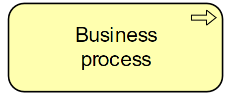
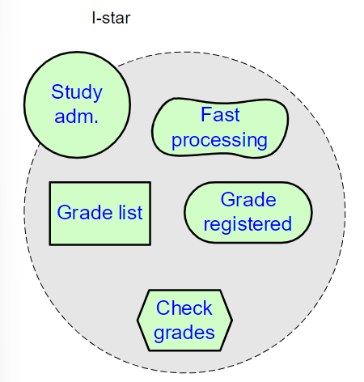
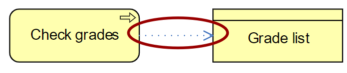
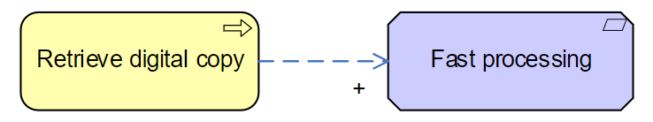

<link href="./../styles.css" rel="stylesheet"></link>
Week 01 : Goal-oriented Requirements Engineering

# Goal-oriented Requirements Engineering
Used to define the context in which an application works
- Time
- Place
- Information
- Operations
- Stakeholders

So it creates a foundation and common understanding of how the system (should) work.

**Goals**:
* Use of goals as a starting point to identify, elicit, document, specify and analyze requirements
* Goals are objectives that the system aims to achieve
* Goals are meant to specify why a requirement is needed, which tasks are required to reach it, and which ones may hamper its achievement

hence, it covers the collumn for the motivational viewpoint and the row for the contextual perspective in the Zachmann Framework.

## Elements for modelling

* Participanpants

| Types | Describtion | I-star symbol | Archimate symbol |
| ----- | ----------- | ------------- | ---------------- |
| Actor/Stakeholder | The role of an individual, team or organisation (or classes thereof) that represents their interest in the outcome of the application |  | 
| Agent             | A business entity that is capable of performing a set of behaviours. |  | 
| Role              | The responsibility for performing specific behaviour, or the part one plays in a particular action or event.  |  | 

| Types | Describtion | I-star symbol | Archimate symbol |
| ----- | ----------- | ------------- | ---------------- |
| Goal      | An intent, direction or desired end state for an organisation and its stakeholders. |  | 
| Quality   | A criteria that must be met by the architecture. |  | 
| Task      | An/a set of action(s) to achive something |  | 
| Resource  | A object concept |  | 

| Relations | Description | I-star Symbol | Archimate Symbol |
| --------- | ----------- | ------------- | ---------------- |
| Specialisation | a is a A | ITU $-ISA\rightarrow$ Uni | ITU &#8702; Uni
| Assignment | a plays the role of an A | Bab $-Plays\rightarrow$ MSc Student | Bab $\boldsymbol{\cdot}\rightarrow$ MSc Student
| Composition | a is part of/cannot exist without A | topping $-Is\_part\_of\rightarrow$ pizza | topping &#8212;&#9830; Pizza

| Associating elements to participants | |
|-----------------|-|
| I-star | Archimate |
|  |   |

## Goal Refinement

| Type | I-star | Archimate |
| ---- | ------ | --------- |
| Decomposition |  |  |
| Specialization |  | 
| Realization(inclusive)  |  | 

## Task Refinement
| Type | I-star | Archimate |
| ---- | ------ | --------- |
| Task Decomposition |  | 
| Task Specialization |  | 

## Resources for task execution
| I-star | Archimate |
| ------ | --------- |
|  | 

## Contribution links
| I-star Type | Archimate Type | I-star | Archimate |
| ----------- | -------------- | ------ | --------- |
| Make | Influence Relation |  | 
| Help | Influence Relation |  | 
| Hurt | Influence Relation |  | 
| Break| Influence Relation |  | 

# Archimate-exclusive intentional elements
| Type | Description | Symbol |
| ---- | ----------- | ------ |
| Driver | An external or internal condition that motivates an organisation to define its goals and implement the changes necessary to achieve them. | 
| Assesment | The result of an analysis of the state of affairs of the enterprise with respect to some driver. | 
| Constraint | A factor that prevents or obstructs the realisation of goals. | 
| Priciple | A qualitative statement of intent that should be met by the architecture | 

**Example**:\

# I-star-exclusive social dependencies

**Example**:\

## Reasoning

| Type | Symbol |
| ---- | ------ |
| Denied | 
| Partially denied |
| Partially satisfied |
| Satisfied | 

### Forward analysis (AND-Decomposition)

### Forward analysis (OR-Decomposition)
