# Week 03 Notes

ArchiMate is an open and independent enterprise architecture modeling language that provides instruments to support enterprise architects in describing, analyzing, and visualizing the relationships among business domains in an unambiguous way.

## Cheat Sheet
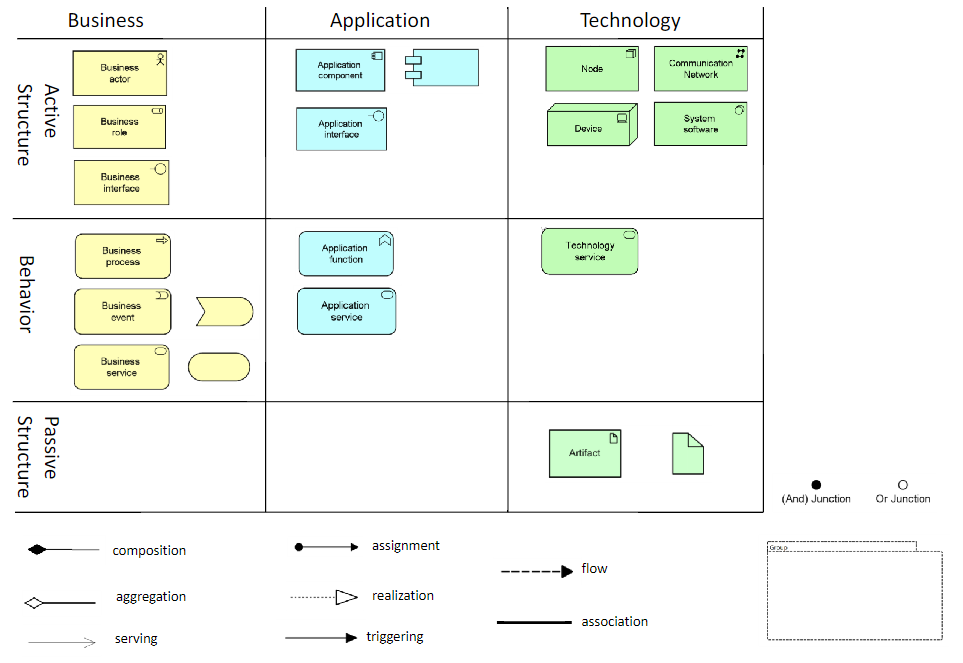

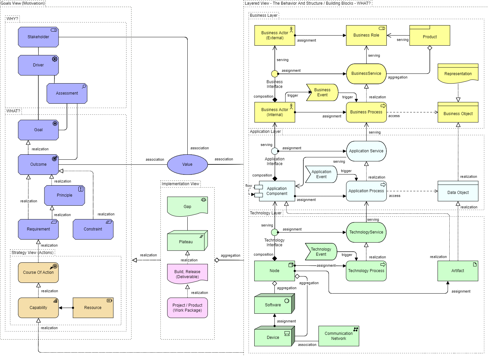

## Key Concepts

### Layers
ArchiMate defines three main layers that represent different levels of abstraction within an organization:

1. **Business Layer**:
   - Represents the business services offered to customers, external entities, and the organization.
   - Includes processes, functions, events, and products.

2. **Application Layer**:
   - Represents the application services that support the business layer.
   - Includes software applications and their interactions.

3. **Technology Layer**:
   - Represents the technological infrastructure supporting applications and business functions.
   - Includes hardware, networks, and system software.

### Aspects
ArchiMate also identifies three aspects that describe different facets of an enterprise:

1. **Active Structure**:
   - Elements that have the capability to perform behavior (e.g., business actors, application components, devices).

2. **Behavioral**:
   - Elements that define the behavior of an active structure (e.g., processes, functions, services).

3. **Passive Structure**:
   - Elements that are acted upon by behavior (e.g., business objects, data objects, artifacts).

## Elements

### Active Structure Elements
- **Business Actor**: An organizational entity that is capable of performing behavior.
- **Application Component**: A modular part of a system that encapsulates its behavior and data.
- **Device**: A physical computing resource.

### Behavioral Elements
- **Business Process**: A sequence of business behaviors that produce specific outcomes.
- **Application Function**: Automated behavior performed by an application component.
- **Technology Function**: Behavior performed by a technology component.

### Passive Structure Elements
- **Business Object**: A concept used within a business domain.
- **Data Object**: Represents data structured for automated processing.
- **Artifact**: A physical piece of information used or produced by a system.

## Relationships
ArchiMate defines several types of relationships to show how different elements are connected:

- **Structural Relationships**: Indicate the structure and composition of elements:
  - composition
  - aggregation
  - assignment
  - realization
- **Dependency Relationships**: Indicate how elements depend on each other:
  - serving
  - access
  - influence
- **Dynamic Relationships**: Indicate the flow and interaction between elements
  - triggering
  - flow
- "**Other Relationgships**"
  - Specialization
  - assosiation
  - junction
### Relationship Arrows

| Relationship    | Symbol                       | Description                                                                              | Example                                                       |
|-----------------|------------------------------|------------------------------------------------------------------------------------------|---------------------------------------------------------------|
| **Composition** | 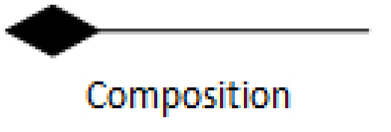 | Indicates that an element is composed of other elements. The filled diamond is closest to the parent element. | Car **composed of** Engine                           |
| **Aggregation** | 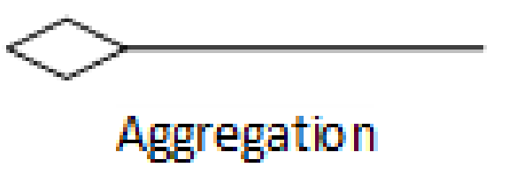 | Indicates that an element groups other elements. The open diamond is closest to the parent element. | Team **aggregates** Players                             |
| **Assignment**  | 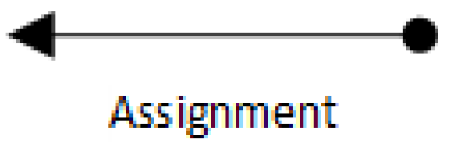  | Indicates that an element is assigned to another element, showing implementation or responsibility. | Actor **assigned to** Role                                     |
| **Realization** | 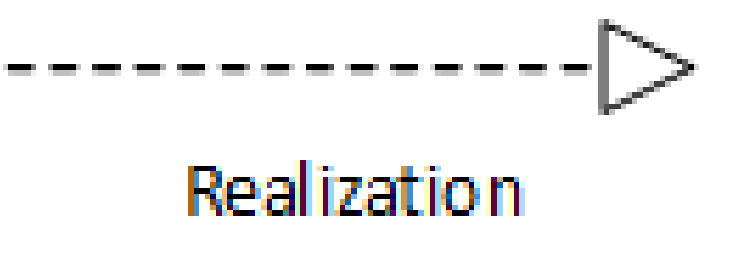 | Indicates that an entity realizes a specification, such as a component realizing a service. | Application Component **realizes** Application Service        |
| **Used By/serving**     |         | Indicates that one element uses the services of another element.                          | Process **used by** Application Component                      |
| **Access**      | 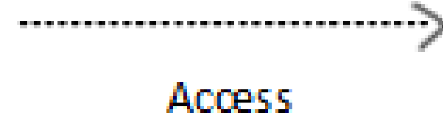          | Indicates that an element accesses a data object. Can be read, write, or read-write access. | Application Function **accesses** Data Object                 |
| **Influence**   | 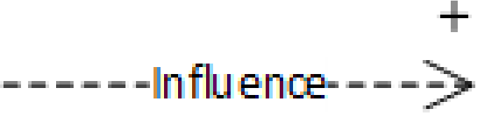    | Indicates that an element influences another element, often used in motivation models.    | Goal **influences** Principle                                  |
| **Triggering**  | 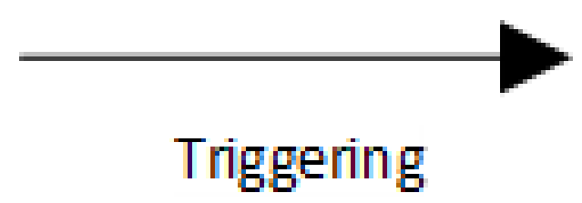  | Indicates that one element triggers another element.                                      | Event **triggers** Process                                     |
| **Flow**        | 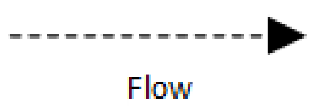              | Indicates the flow of information or resources between elements.                          | Business Process **flows to** Business Process                 |
| **Specialization** | 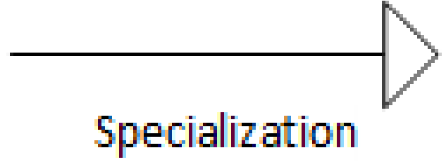 | Indicates that an element is a specialized version of another element.                    | Specialized Role **specializes** General Role                  |

### Strenght

| Strength  | Relationship |
| --------  | ------------ |
| Highest   | Composition   |
|           | Aggregation   |
|           | Realization   |
|           | Assignment    |
|           | Used By/Serving|
|           | Triggering    |
|           | Access        |
|           | Specialization|
|           | Influence     |
| Lowest    | Flow          |

## Example Layers and Elements

### Business Layer
- **Active Structure**: Business Actor (e.g., Customer), Business Role (e.g., Salesperson).
- **Behavioral**: Business Process (e.g., Order Processing), Business Service (e.g., Customer Support).
- **Passive Structure**: Business Object (e.g., Invoice), Product (e.g., Insurance Policy).

### Application Layer
- **Active Structure**: Application Component (e.g., CRM System).
- **Behavioral**: Application Function (e.g., Customer Data Management), Application Service (e.g., Email Service).
- **Passive Structure**: Data Object (e.g., Customer Record).

### Technology Layer
- **Active Structure**: Device (e.g., Server), System Software (e.g., Operating System).
- **Behavioral**: Technology Function (e.g., Data Storage), Technology Service (e.g., Network Service).
- **Passive Structure**: Artifact (e.g., Database Schema).

## Derived relationships
Derived relationships in ArchiMate allow modelers to simplify complex models by inferring indirect relationships between elements based on the existing direct relationships. These derived relationships help in understanding the broader impacts and dependencies within the architecture without cluttering the model with all direct relationships.

### Definition
- **Derived Relationships**: Relationships that are not explicitly modeled but can be inferred from a combination of direct relationships.

### Purpose
- To provide a clearer understanding of the architecture by showing indirect connections.
- To simplify the model by reducing the number of explicitly drawn relationships.
- To help in impact analysis by identifying all relevant relationships.

### How Derived Relationships Work
Derived relationships are inferred based on specific rules and combinations of direct relationships. For example:
- If element A **aggregates** element B, and element B **realizes** element C, it can be derived that element A **realizes** element C.
- If element X **is used by** element Y, and element Y **triggers** element Z, it can be derived that element X **triggers** element Z.

### Types of Relationships and Derivations

#### Structural Relationships
1. **Composition and Aggregation**:
   - Composition and aggregation can derive new composition or aggregation relationships.
   - Example: If `A` **composes** `B` and `B` **aggregates** `C`, then `A` **aggregates** `C`.

#### Dependency Relationships
1. **Assignment and Realization**:
   - Assignment and realization can derive new assignment or realization relationships.
   - Example: If `D` **is assigned to** `E` and `E` **realizes** `F`, then `D` **realizes** `F`.

2. **Used By and Triggering**:
   - Used by and triggering can derive new used by or triggering relationships.
   - Example: If `G` **is used by** `H` and `H` **triggers** `I`, then `G` **triggers** `I`.

#### Dynamic Relationships
1. **Flow**:
   - Flow relationships can derive new flow relationships.
   - Example: If `J` **flows to** `K` and `K` **flows to** `L`, then `J` **flows to** `L`.

### Example
See slides for lecture 3

## Useful Patterns
See slides for lecture 3
