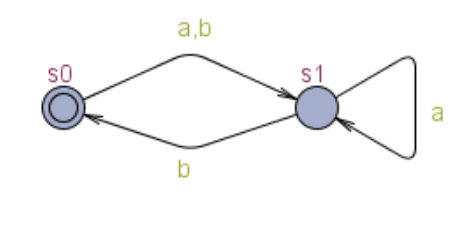
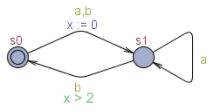
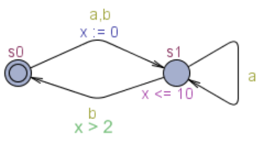
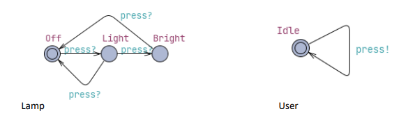

Notes Week 6

Table of Content:
- [Real-time Systems ](#real-time-systems-)
  - [Hard- \& Soft Real-time Systems](#hard---soft-real-time-systems)
- [Automata](#automata)
  - [Büchi Automata ](#büchi-automata-)
  - [Büchi Timed Automata ](#büchi-timed-automata-)
  - [Timed Safety Automata ](#timed-safety-automata-)
- [Timed Automata](#timed-automata)
  - [Language Describtion](#language-describtion)
  - [Semantics](#semantics)
    - [Actions / Transitions](#actions--transitions)
    - [Formal definitions](#formal-definitions)
  - [Example : Light Dimming Lamp](#example--light-dimming-lamp)
- [Testing and Verification](#testing-and-verification)
  - [Liveness](#liveness)
  - [Safety](#safety)
  - [Temporal Logic](#temporal-logic)
  - [Deadlock and Livelock Detection](#deadlock-and-livelock-detection)

## Real-time Systems 
**Definition**:\
A computing system that is designed to respond to events in a given time-frame (not neccessarily a short one). Hence, a system where correctness does not only depend on the logical order of events, but also on their timing.

**Characteristicts**:
1. Timing constraints: *must produce results within a given timeframe*
1. Deterministic: *timing behavior is consistent and predictable* 
1. Predictable: *has predictable and testable behaviour*

(They are often)
1. Utillizing Scheduling Algorihtm: *uses algorithms such as Rate Monotonic Scheduling (RMS), Earliest Deadline First (EDF), and Fixed Priority Scheduling*
1. Concurreny: *has multiple concurrent processes, that needs careful management to avoid conflict*
1. Fault Tolerant: *includes fault-tolerant mechanisms to eensure reliability in the event of conflicts*

### Hard- & Soft Real-time Systems
- **Hard real-time systems**: tasks must be completed within a predetermined time frame. Failure to meet these deadlines could lead to catastrophic outcomes. Such systems are often found in safety-critical applications, such as automotive control systems, avionics, medical devices, and industrial control systems.
- **Soft real-time systems**: less strict compared to hard real-time systems. They aim to process data and respond to inputs asap, however missing a deadline results in non-catastrophic outcomes. Instead, it may degrade the system's performance or quality of service. Examples include video streaming services, where delays might cause reduced video quality, but the system continues to operate.

## Automata

### Büchi Automata 
Finite automata used in formal languages, particularly used for formal verification and monotoring of real-time systems. 
They are finite statemachines that takes infinite inputs.

**Structure**:
- A finite set of states
- A starting state
- An alphabet
- A transistion function 
- A set of acceptance states

They are similar to nondeterministic finite automatons (NFA), but accepts inifite inputs

### Büchi Timed Automata 
Combines the concepts of Büchi Automata and Timed Automata to model and verify time-critical behaviour of real-time systems. Büchi has the cababilities to analyse inifite events and Timed Automata has clocks and timing constrains. Hence, Büchi Timed Automatons are relevant for specifying and verifying infinitly running real-time systems that has events that must consider timing constaints. 

**Structure**:
- A finite set of states
- Transitions between these states, which can be triggered based on both the occurrence of events and the satisfaction of timing constraints
- A set of clocks that measure the passage of time
- Timing constraints on transitions and in states, which can involve conditions on the clocks
- A set of accepting states, which, in the context of an infinite execution, must be visited infinitely often for a run to be accepted

### Timed Safety Automata 
A specialized form of timed automata focused on ensuring that certain "safety" conditions are always met over time, which asserts that "nothing bad will happen" during the execution of a system.

**Structure**:
- A finite set of states
- Transitions between states, depending on both events and timing conditions
- A set of real-valued clocks, measuring the passage of time
- Constraints on these clocks that must be satisfied for transitions to occur or for the system to remain in a particular state

The key addition for Timed Safety Automata is the explicit specification of safety conditions. These conditions are formulated such that, throughout the automaton's execution, the conditions must always be satisfied to avoid unsafe states or behaviors.

Time Safety Automatons can optimize the design  of a system, by identifying conditions for safety properties and can aid anayling the safety of a system.

## Timed Automata

### Language Describtion
$(L, l_0, C, A, E, l),$

where:
- **Locations** $L$: is the set of locations/states
- **Initial Location** $l_0$: initial location/state
- **Clocks** $C$: is the set of clocks
- **Actions** $A$: is the set of actions, co-actions & internal (tau) actions. The events or triggers that cause transitions between locations.
- **Edges** $E$: $E \subseteq L \times A \times B(C) \times 2^C \times L$ is the set of edges.\
Represent the transitions from one location to another. Each edge is associated with:
    - An action from $A$ that triggers the transition
    - A guard, which is a condition based on clock values that must be true for the transition to occur
    - A set of clocks to reset when the transition occurs, allowing the automaton to measure time intervals starting from the transition.
- **Invariant** $I$: $L \implies B(C)$. Each location has an associated invariant condition that must hold true as long as the automaton remains in that location. These are constraints on the clocks that prevent time from progressing beyond certain bounds within a location.

### Semantics

#### Actions / Transitions
There are two types of transitions: 

**Timed Actions/Transitions**:\
These represent the passage of time and involve all clocks increasing at the same rate. Time transitions are continuous and are subject to invariants at each location, which are conditions that must hold for time to pass while the system is in that location.

**Discrete-/tau-/labelled Actions/Transitions**:\
These occur instantly and correspond to changes in location. They're triggered by actions and can involve resetting some clocks. Discrete transitions are subject to guards, which are conditions based on clock valuations that must be true for the transition to occur.

#### Formal definitions
**Notation**:\
A state is depicted as $\langle l, u\rangle$,\
An action/transition is depicted as $\langle l, u\rangle \xrightarrow{\alpha} \langle l', u'\rangle$.\

**Time Passage**:\
If $u$, $u+d \in I(l)$ and $d \in \reals^+$, then:\
$\langle l, u \rangle \xrightarrow{d} \langle l, u+d \rangle$

If $u+d$ is within the invariant $I$ of location $l$ ($I(l)$), and $d$ is a non-neg real number, then the system can let time pass by $d$, which changes the state from $\langle l, u \rangle$ to $\langle l, u+d \rangle$

**Discrete Actions/Transition**:\
If $l \xrightarrow{\tau, \alpha, r} l'$, $u \in g, u' = [r \rightarrowtail 0] u$ and $u' \in I(l)$, then:\
$\langle l, u \rangle \xrightarrow{\alpha} \langle l', u' \rangle$

If there's a transition from location $l$ to location $l'$, where the transition invovles action $\alpha$, a guard $g$ and a reset set $r$, and the current clock valueation $u$ satisfies g, then the system can transition from state $\langle l, u \rangle$ to $\langle l', u' \rangle$, where $u'$ is the clock valueation after resetting clocks according to $r$.

### Example : Light Dimming Lamp

Here, we have the language:
$(L, l_0, C, A, E, l),$
- Locations $L$: $\{Off, Light, Bright\}$
- Initial location $l_0$: $Off$
- Actions $A$: $pres?$

## Testing and Verification

Apply model checking.

### Liveness
These properties assert that something good will eventually happen, given infinite time. For example, "if you input money into the vending machine, you will eventually receive a product" is a liveness property. It’s focused on ensuring progress and eventual success.

a set of properties that guarantee that certain actions or state changes will eventually occur.

liveness properties assert that "something good will eventually happen"

Doing nothing should satisefy that nothing bad will happen

Liveness properties are violated in “infinite time”/has to be finite

In real-time systems, where timing constraints are as critical as functional behavior, liveness properties might include guarantees such as:

A response to an input will be provided within a bounded time frame.
A periodic event will occur, such as a watchdog timer that must be reset before it expires.
Progress conditions in a distributed system, where a process must eventually proceed to a new state and cannot be indefinitely delayed.

### Safety

Has to be infinite.

These properties assert that something bad will never happen. For example, "the vending machine will never dispense a product without first receiving the correct payment" is a safety property. It’s focused on preventing undesirable events.

### Temporal Logic
Temporal logic, such as Linear Temporal Logic (LTL) or Computation Tree Logic (CTL), is often used to specify liveness properties. For example, an LTL formula might specify that whenever a certain condition becomes true, another condition must become true at some point in the future. Temporal logic provides a powerful language for expressing liveness properties that are checked during model checking.

### Deadlock and Livelock Detection
A crucial part of ensuring liveness is detecting and preventing deadlocks (where processes are waiting indefinitely for resources) and livelocks (where processes are active but not making progress). Verification tools and testing must be able to detect such conditions.