<link href="./../styles.css" rel="stylesheet"></link>
# Exercises

## Model the following patterns in a DCR-graph
1. Direct Precedence of a Task. “Every time B occurs, it should be directly preceded by A.” If B occurs without a directly preceding A, the rule is violated. For instance, traces ⟨ACCAAC⟩ and ⟨ABCAAB⟩ comply to the rule, whereas ⟨ABACB⟩ violates the rule.

My solution             |  Teachers solution
:-------------------------:|:-------------------------:
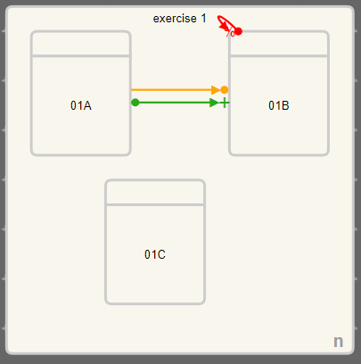  |  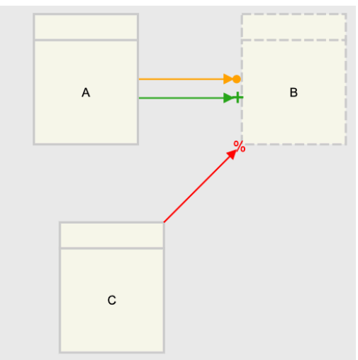

2. Direct Precedence or Simultaneous Occurrences of Tasks. “Task A must always be executed simultaneously or directly before task B.” (hint: consider A/B as non-atomic tasks)

|Teachers solution
|:-------------------------:
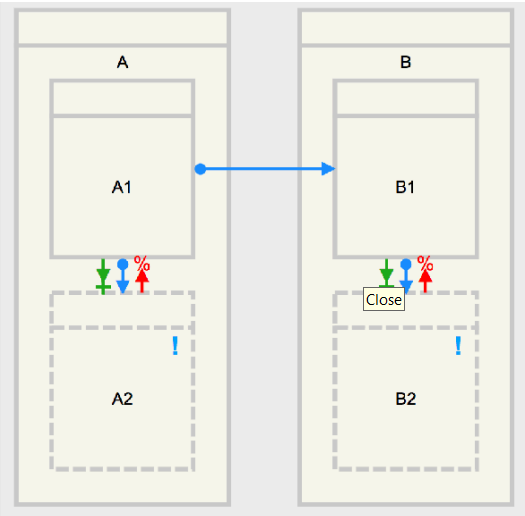

3. Bounded Existence of a Task: Task A should be executed exactly k times.” If A occurs less than or more than k times, the rule is violated. For instance, for k = 2, the trace ⟨BCADBCAD⟩ complies to this rule and ⟨BCADBCAAD⟩ violates the rule.

|Teachers solution
|:-------------------------:
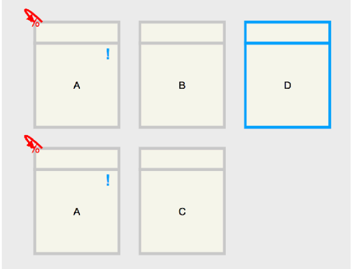

4. Execution in Between. “Task B should be performed not before task A has been executed, and not later than C.”

My solution             |  Teachers solution
:-------------------------:|:-------------------------:
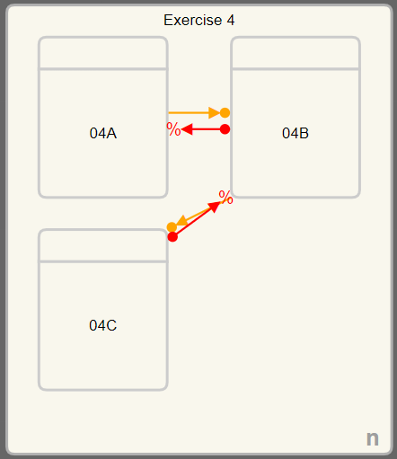  |  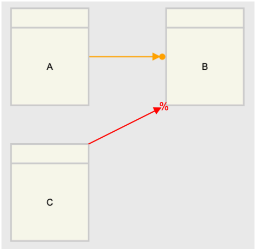

## Soundness
Discuss in pairs whether the following processes are sound.

Soundness (behavioral correctness), *iff*
   - Option to complete: any running process instance must eventually complete
   - Proper completion: when the process completes, each token of the process must be in a different termination event
   - No dead activities: any activity can be executed in at least one process

### Exercise 1

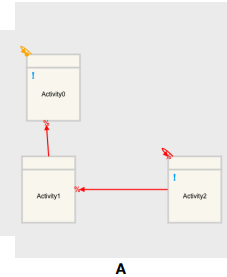

This figure is not sound as all the running activities can not complete, since A0 needs to be executed to execute which is impossible. Possible paths: {A1}, {A2}, {A1, A2}

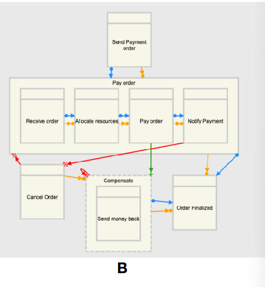

This figure is not sound either as for the order to be finalized, it needs the compensation activities to be executed, which can only be executed if the order has been canseled - which cannot happen if  notify payment has been executed - which is also neccessary for the order to be finalized.

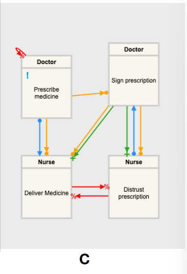

This process *is* sound.

* **No Dead Activities**: All activities can potentially be executed:
  * SP and DM are directly enabled by PM.
  * DP is enabled by SP.
  * DM and DP mutually exclude each other, but each can still occur.
* **Proper Completion**: The model reaches completion when:
  * PM is followed by SP.  
  * SP enables and triggers DM and possibly DP.
  * All conditions are satisfied without any leftover mandatory events blocked by exclusions.
* **No Improper Execution Paths**:
  * The mutual exclusions of DM and DP ensure that only one of these paths is taken once SP has occurred. This avoids scenarios where conflicting actions occur simultaneously.

### Exercise 2

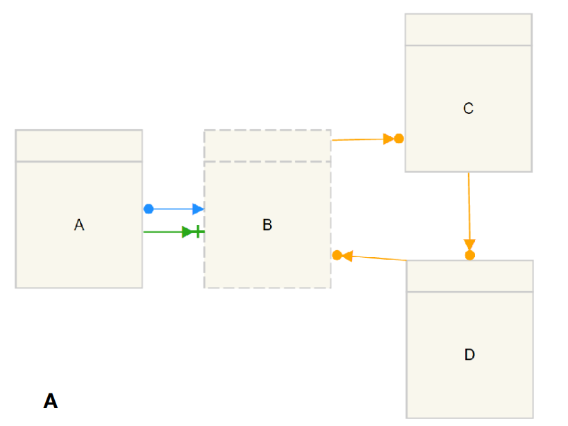

This figure *is not* sound.

* **No Dead Activity**: 
  * Not all activities can be executed since B needs D to execute and D needs C, which needs B to execute. Hence, we have a deadlock in B.
* **No improper Completion**: 
  * The model cannot complete as B cannot execute, and since A expects B to execute, the model cannot complete.

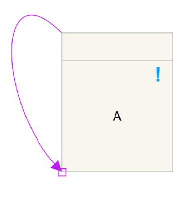

This figure *is not* sound.

The process cannot execute, since the milestone has the rule, if  $A\rightarrow\diamond B$, then once A is executed or pending, B is no longer allowed to execute. Hence, since A is pending (marked with the `!`), then A cannot execute.

### Exercise 3

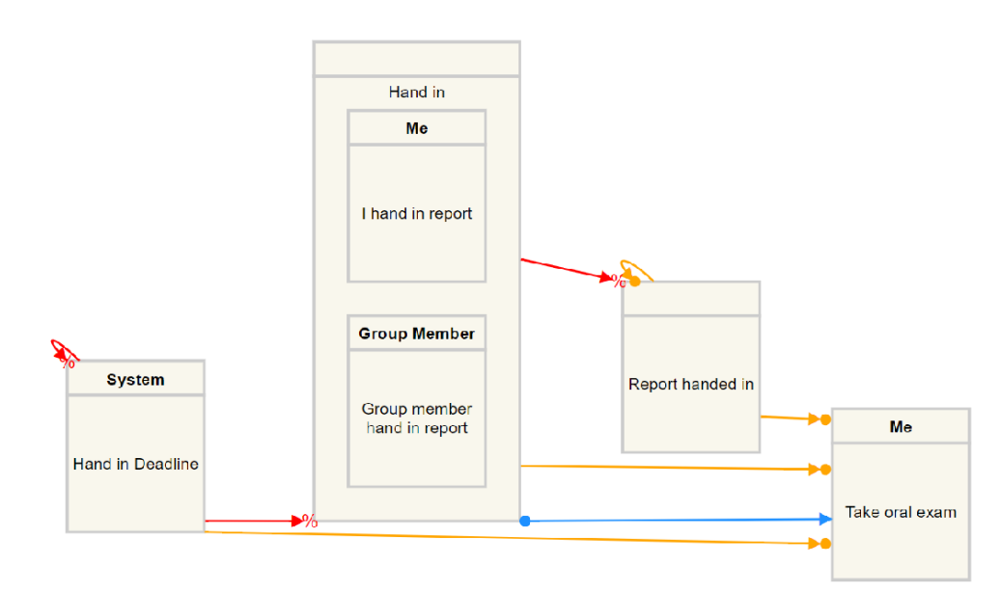

This figure *is not* sound.

* **No Dead Activities**:
  * The activities may not all be executable based on the HD and its exclusions. If HD occurs before IHR or GMHR, those activities become impossible, leading potentially to dead activities if not timed correctly.
* **Proper Completion**:
  * Completion appears to rely on both reports being handed in (implicitly) and subsequently allowing TOE to occur. RH also needs to be executed, to execute - which is not possible.
* **No Improper Execution Paths**:
  * There might be an issue if HD excludes the possibility to complete IHR and GMHR, preventing RH and thereby blocking TOE. This would violate the soundness criteria as it creates a path where completion isn't possible due to HD triggering too soon.