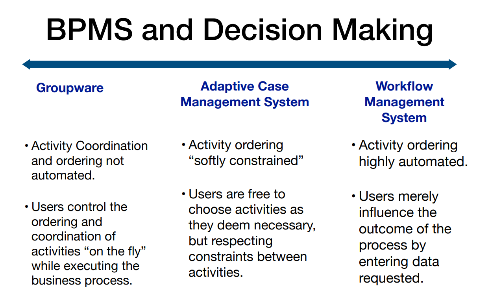

Notes week 07: Declarative Process Modelling

Table of contents:
- [Complexity](#complexity)
  - [Examples](#examples)
- [Predictability](#predictability)
  - [Examples](#examples-1)
- [Repetitiveness](#repetitiveness)
  - [Examples](#examples-2)
- [Business Process Management (BPM)](#business-process-management-bpm)
  - [Groupware Systems](#groupware-systems)
  - [Workflow management systems](#workflow-management-systems)
  - [Adaptive Case Management Systems](#adaptive-case-management-systems)
  - [BPMS and Decision Making](#bpms-and-decision-making)
  - [Flexibility \& Support](#flexibility--support)
  - [Trends in BPM](#trends-in-bpm)
- [Modelling Declarative Processes](#modelling-declarative-processes)
- [DCR graphs](#dcr-graphs)
  - [States](#states)
  - [DCR Grammar](#dcr-grammar)
  - [Enabledness](#enabledness)
  - [Effects](#effects)
  - [Traces](#traces)
  - [Termination](#termination)
  - [The Null Process](#the-null-process)
  - [Deadlocks](#deadlocks)
  - [Livelocks](#livelocks)
  - [Liveness](#liveness)
- [Correctness in Business Processes](#correctness-in-business-processes)

## Complexity
Complexity refers to the intricacy of the process interactions, the diversity of tasks, and the rules governing these tasks. In a highly complex environment, there may be numerous potential paths through the process, governed by a set of rules and constraints rather than a predetermined sequence of steps. Declarative models thrive in complex scenarios because they allow for a wide range of outcomes and adapt to changes in the environment or requirements without needing the process model to be redefined from scratch.

Declarative models manage complexity by specifying constraints that guide process execution. This allows for managing intricate dependencies between tasks and accommodating complex decision-making scenarios without dictating a fixed procedure. As a result, the model can adapt to unforeseen changes or requirements, making it highly flexible.

### Examples

- **Low Complexity**: A local library's book lending process. The rules are straightforward (e.g., register, borrow, return by due date), and the interactions between tasks are minimal. Declarative models would include basic constraints like borrowing limits and due dates.

- **Medium Complexity**: An event planning process for corporate functions. This involves multiple stakeholders (clients, vendors, venue management), with varying rules and constraints depending on the event type, size, location, and client preferences. A declarative model here would need to specify constraints for each aspect, allowing for flexibility in execution as long as the constraints are met.

- **High Complexity**: A global supply chain management process involving multiple countries, regulations, transportation modes, and stakeholders. The complexity is high due to the varying regulations, unpredictable transportation delays, and the intricate coordination required. Declarative process modeling would focus on defining broad rules for compliance, coordination, and logistics without specifying exact sequences of actions, allowing for adaptability to changing conditions.

## Predictability
How easy is to predict how the process will execute and their outcomes.

Predictability refers to the ability to anticipate the sequence of tasks in a process. In declarative process modeling, predictability can be variable. For processes with well-understood rules and constraints, outcomes may be predictable within a certain range. However, due to the flexible nature of declarative models, the exact path of execution might not be predictable in advance, especially in scenarios with many possible task sequences.

Balancing Flexibility and Predictability: While declarative models excel in flexibility, ensuring some level of predictability is important for planning and optimization. Techniques such as simulation, historical data analysis, and constraint refinement can help anticipate the range of possible outcomes and improve process predictability. 

### Examples
- **High Predictability**: A fast-food restaurant’s order-to-delivery process. While there might be variations in the order, the sequence of steps (order placement, preparation, packaging, and delivery) is quite predictable. Declarative models might define constraints related to preparation time and delivery deadlines but allow flexibility within those constraints.

- **Medium Predictability**: A software development process using agile methodology. While the overall phases (planning, development, testing, deployment) are known, the specifics of each iteration can vary based on client feedback and testing results. Declarative modeling would involve constraints around sprint durations and testing criteria while allowing the sequence and specifics of tasks to adapt to the project's needs.

- **Low Predictability**: Emergency response operations (e.g., natural disasters). The nature and sequence of tasks can be highly unpredictable, depending on the emergency's specifics. Declarative models would define broad objectives and constraints (e.g., prioritize life-saving measures, establish command centers) but allow for significant flexibility in the field.

## Repetitiveness
Repetitiveness refers to the frequency and consistency with which tasks within a process are repeated. In highly repetitive processes, tasks occur in a regular and predictable manner. While declarative modeling is well-suited to manage variability and complexity, it can also accommodate repetitive tasks by defining constraints that effectively mandate the recurrence of certain actions under specific conditions.

Even in repetitive scenarios, declarative models provide value by allowing exceptions and variations to be seamlessly integrated into the process. This ensures that routine operations are maintained while still offering the flexibility to adapt to exceptions or changes in the process environment.

### Examples

- **High Repetitiveness**: Manufacturing assembly line processes. Tasks are highly repetitive, with each unit undergoing the same sequence of operations. Declarative process models might set constraints related to quality standards and timing but would generally expect the same steps to be followed for each unit.

- **Medium Repetitiveness**: Routine healthcare check-ups. While the general structure of a check-up is consistent (patient intake, vital signs measurement, consultation, prescription or follow-up if needed), variations occur based on the patient's health condition. Here, declarative models would allow for standard processes but also accommodate variations as needed by medical findings.

- **Low Repetitiveness**: Research and development (R&D) projects. The nature of R&D work is exploratory, with tasks and directions often changing based on findings and hypotheses testing. Declarative process modeling in this context would establish goals and constraints related to budget, timelines, and safety standards but leave the sequence and specifics of tasks highly flexible to accommodate innovation.

## Business Process Management (BPM) 

Business Process Management (BPM) systems are comprehensive technology platforms that enable organizations to design, model, execute, monitor, and optimize their business processes. 
They help organizations align operations with business strategy, ensuring more efficient resource allocation and better performance. 

BPM systems support collaboration, coordination and decision making in business processes.

### Groupware Systems
**Supports human collaboration and co-decision**.\
They allow for activity coordination and ordering that is not automated. Users control the ordering and coordination of activities "on the fly" while executing the business process. This indicates a high degree of flexibility but may come with less systematic control and possibly lower efficiency for repetitive tasks. \
These systems include tools like email, shared calendars, document sharing platforms, and real-time communication software. 

### Workflow management systems
**Explicitly control ordering, coordination and execution of activities with little human intervention**.\
Workflow Management Systems are at the other end of the spectrum, providing a highly structured environment where activity ordering is explicitly controlled and highly automated. In such systems, users have less discretion in changing the process flow; they mainly influence the outcome by providing necessary data. This can be highly efficient for repetitive and predictable processes but may offer less flexibility for processes requiring human judgment.

### Adaptive Case Management Systems
They provide a middle ground with "softly constrained" activity ordering. Users have the freedom to choose activities as they deem necessary within the boundaries of the process constraints. This setup supports a balance of flexibility and structured decision-making, suitable for knowledge-intensive processes where varying solutions may be required for different cases.

### BPMS and Decision Making

### Flexibility & Support
Flexibility refers to the degree to which users can make local decisions about how to execute the process. Groupware provides the highest flexibility, while workflow management systems offer the least.

Support means the degree to which the system makes centralized decisions about process execution. Here, workflow management systems offer the most support, presumably because the processes are more defined and automated, whereas groupware provides the least.

### Trends in BPM
- **Imperative Modeling**: This traditional approach involves modeling specific process paths, using tools like flowcharts, activity diagrams, and BPMN (Business Process Model and Notation). It’s suited for repetitive and predictable processes where the sequence of tasks is predefined.
- **Declarative Modeling**: In contrast, declarative modeling focuses on the rules and constraints governing the processes rather than exact sequences. This approach is better suited for knowledge-intensive, highly-variable processes and is represented by methods such as constraints, Linear Temporal Logic (LTL), DECLARE, and DCR Graphs. This trend reflects a movement toward greater flexibility and adaptability in BPM.

## Modelling Declarative Processes
1. What are the start and goal activities?
2. What are resources are necessary for activities?
3. How are activities ordered?

## DCR graphs

### States
- Executed: The event has occurred at least once.
- Included: The event is currently available to occur.
- Excluded: The event is currently not available.
- Pending: A response relation requires the event to occur in the future.

### DCR Grammar

**Basic Assumptions**:
- **Universe of Events** $\Epsilon$: A fixed set of events that can occur in the process.
- **Labels** $L$: A set of labels that can be attached to events for identification.
- **Mapping** $\lambda$: A function that maps each event from the universe of events to a label.

**Processes**:
- **Process** $P, Q$:Represents a DCR process, defined by a marking $M$ and a set of transitions $T$.
- **Transition/Constraints/Relations** $T, U$: Describe the possible changes (transitions) in the process:
  - Conditions:\
**B cannot be done before A**\
$A\rightarrow \boldsymbol{\cdot}B$
  - Responses:\
**If A executes then B must execute**\
$A\boldsymbol{\cdot} \rightarrow B$
  - Exclusions:\
**If A executes it prevents B from executing**\
$A\rightarrow \% B$
  - Inclusions:\
**If A executes it allows B to execute**\
$A\rightarrow + B$
  - Milestone:\
**Once B occurs, A is no longer allowed to execute**\
$A\rightarrow\diamond B$
- **Marking** $M, N$: The state of the process at any given time, containing which events are executed $e$, included $i$, or pending $p$.
  - $M={e,i,p}$: A set with subsets of events that are executed, included, or pending.
- **Labeling** $\lambda$: The function that assigns labels to events.
- **Conditions** $\phi$ : A triple consisting of the conditions $h$, inclusions $i$, and pending responses $p$.
  - $h,i,p$: Each a subset of $\Epsilon \times \Epsilon$, indicating the existence of condition, inclusion, or pending relations between pairs of events.

### Enabledness
Enabledness refers to whether an event is allowed to take place given the current state of the process. An event is considered "enabled" if all the preconditions or conditions set by the DCR Graph are satisfied at that moment in time.\

Factors that influence enabledness:
- Inclusion: An event must be included (i.e., not excluded) to be enabled. If an event has been excluded by another event, it cannot occur until it is included again.
- Conditions: All condition relations pointing to an event must be satisfied. This means that all events that have a condition relation to the considered event must have occurred at least once.
- Milestones: Any milestone relations that protect an event must be respected. An event with a milestone relation can only be enabled if the milestone event has not occurred or has been reset.

### Effects
Effects describe the changes that occur in the state of the DCR Graph when an event is executed. 

### Traces
A trace in a DCR Graph is a sequence of events that reflects one possible execution path through the process. Traces are used to analyze the behavior of the process and to verify that all potential executions meet the desired outcomes. A valid trace must respect all the constraints imposed by the graph, such as conditions, responses, inclusions, and exclusions.

### Termination
Termination refers to a state in a process where no further events can occur, either because all required events have been executed or because the remaining events are not enabled due to the graph's constraints. Termination can be seen as a successful completion if all the goals of the process have been met, which generally means that all pending response relations have been satisfied.

### The Null Process
The null process in a DCR Graph is a process where no events are enabled. It represents the baseline or starting state of the graph where no actions have taken place yet. In terms of execution, it can also refer to a state where no further progress can be made because no events are enabled, which might indicate an error or incomplete setup of the process.

### Deadlocks
A deadlock is a situation in a process where certain events cannot be executed due to circular conditions or other constraints, even though the process has not terminated. This means that there is a standstill where no event is enabled but the process is not complete – not all intended actions have been carried out and not all response obligations have been met.

### Livelocks
Livelocks occur when there is a non-terminating cycle of events that does not lead to progress. The process does not reach a deadlock because events are still enabled and can be executed, but it enters a state where it only loops through a certain sequence of actions without ever reaching a state of termination or satisfying all the required conditions and responses.

### Liveness
Liveness in a DCR Graph is a property that ensures that if an event is intended to happen, it eventually will. This means there are no incorrect constraints or conditions that permanently prevent the execution of any required event. A process with good liveness ensures that it is always possible to complete the process by executing all necessary events, fulfilling all obligations, and not getting stuck in deadlocks or livelocks.

## Correctness in Business Processes
1. Compliance (semantic correctness)
2. Soundness (behavioral correctness), *iff*
   - Option to complete: any running process instance must eventually complete
   - Proper completion: when the process completes, each token of the process must be in a different termination event
   - No dead activities: any activity can be executed in at least one process
3. Syntax Conformance (structural correctness)
   - Key: does it “reads well”? Syntax 
   - Common errors: Unconnected relations, missing variables, wrong timestamps etc.

