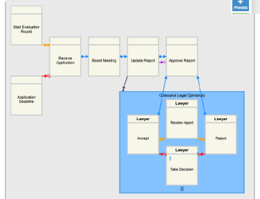

Notes week 08: Declarative Process Modelling: Advanced 
Operators and Compliance

Table of contents:
- [Dynamic Condition Response Graphs ( DCR Graphs)](#dynamic-condition-response-graphs--dcr-graphs)
    - [Nesting](#nesting)
    - [Subprocesses](#subprocesses)
      - [Single-Instance Subprocesses](#single-instance-subprocesses)
      - [Multi-Instance Subprocesses](#multi-instance-subprocesses)
    - [Enabledness Semantics](#enabledness-semantics)
    - [Execution Semantics](#execution-semantics)
    - [Transitions and Traces](#transitions-and-traces)
    - [Temporal Dependencies](#temporal-dependencies)
    - [Operational Semantics: Timed Transitions](#operational-semantics-timed-transitions)
    - [Compliance in DCR](#compliance-in-dcr)
  - [Implementing DCR Graphs (copied from slides created by Hugo A. López)](#implementing-dcr-graphs-copied-from-slides-created-by-hugo-a-lópez)
    - [Enabledness](#enabledness)
    - [Execute](#execute)
    - [Accepting](#accepting)


# Dynamic Condition Response Graphs ( DCR Graphs)
A tuple $(E,R,M)$ where:
- (labled) Events $E$: the nodes of the graph
- Relations $R$: the edges of the graph 
  - Conditions:\
**B cannot be done before A**\
$A\rightarrow \boldsymbol{\cdot}B$
  - Responses:\
**If A executes then B must execute**\
$A\boldsymbol{\cdot} \rightarrow B$
  - Exclusions:\
**If A executes it prevents B from executing**\
$A\rightarrow \% B$
  - Inclusions:\
**If A executes it allows B to execute**\
$A\rightarrow + B$
  - Milestone:\
**Once A is executed or pending, B is no longer allowed to execute**\
$A\rightarrow\diamond B$
- Markings $M$: a triple $(Ex, Re, In)$ where:
  - $Ex$: are previously executed events
  - $Re$: pending events
  - $In$: current included events


### Nesting
Decreases the number of connections (arrows) without affecting its semantics.

- Nesting does not have their own markings

### Subprocesses
A subprocess is a defined sequence of process steps that is part of a larger process. It functions as a process within a process. Subprocesses can be used to simplify complex process diagrams by abstracting parts of the process and to handle repetitive or common tasks within different parts of the larger process. They encapsulate a specific portion of the process with its own distinct start and end points, which can sometimes be triggered or executed independently of the main process.

#### Single-Instance Subprocesses
A single-instance subprocess is designed to be executed once during the process flow. It is called at a specific point in the process, performs its defined sequence of steps, and then control returns to the main process upon completion. Single-instance subprocesses are used when a specific task or sequence of tasks needs to be performed only once in the process flow.

For example, in a loan approval process, a single-instance subprocess might handle the verification of an applicant's credit history. This subprocess would be initiated once for each loan application.


#### Multi-Instance Subprocesses
Multi-instance subprocesses, on the other hand, can be instantiated multiple times in parallel or sequentially. They are used when a set of tasks needs to be repeated for a collection of items, such as multiple applicants, products, or cases. Each instance of the subprocess handles one item or set of data independently of the other instances.



Multi-instance subprocesses can be further categorized into:

- **Sequential Multi-instance**: Each instance of the subprocess starts only after the previous one has completed. This is used when the tasks must be carried out one after another, possibly because each instance might depend on the output of the previous one.

- **Parallel Multi-instance**: All instances of the subprocess run in parallel without waiting for each other. This is used when the tasks can be performed independently and simultaneously, often leading to a reduction in overall process time.

An example of a multi-instance subprocess might be a product assembly process where each unit of the product must go through the same set of assembly steps. Each unit's assembly can be modeled as a subprocess, and if the assembly lines can handle multiple products at once, this would be a parallel multi-instance subprocess.

- Subprocesses have their own markings

### Enabledness Semantics
An event e is enabled (written as $e\in enabled(G)$, where graph G is $G=(E,R,M)$, with marking $M=(Ex, Re, In)$) iff:
- e is included / $e \in In$
- All conditions for e have been executed / $Included \cap conditionsOf(e) \subseteq Executed$ / $In \cap (\rightarrow\boldsymbol{\cdot} e) \subseteq Ex$
- There are no pending milestones for e / $Included \cap milestoneFor(e) \subseteq Events.exclude(Responses)$ /  $In \cap (\rightarrow\diamond e) \subseteq E \backslash Re$

### Execution Semantics
Let dcr graph $G=(E,R,M)$, with marking $M=(Ex, Re, In)$.
Assume $e \in enabled(G)$. When executing e, we get the dcr graph $G=(E, R, M')$, where $M'=(Ex', Re', In')$, which are defined as:
- $Executed'=Executed \cup e$ / $Ex' = Ex \cup e$
- $Responses'= Responses.exclude(e) \cup (responseOf(e))$ / $Re'=(Re \backslash e) \cup (e \boldsymbol{\cdot}\rightarrow)$
- $Included' = Included.exclude(eventsPreventedBy(e)) \cup (eventsConditionedBy(e))$ / $In' = (In \backslash (e \rightarrow \% )) \cup (e \rightarrow +)$ 

### Transitions and Traces
Let dcr graph $G$, if $e \in enabled(G)$, and executing e results in graph $H$, then we say that $G$ has transition on $e$ to $H$.\
A run of $G$ is a sequence of graphs $G_i$ resulted by transitioning between events $e_i$ s.t. $G=G_0 \xrightarrow{e_0}G_1 \xrightarrow{e_1}... G_i \xrightarrow{e_{i}}$, until it terminates.

A trace of G is a sequence of labels of events $e_i$ associated with a run of G

**Accepted Trace**:
A run is accepting iff: let $n$ be an index in $e_i$, then $\forall e_n \in In(G_n) \cap Re(G_n), \exists m \geq n$, s.t. $e_m = e \cup e \notin In(G_m)$. 

An event e in a DCR graph can have a response requirement, meaning that once it becomes included (An event that currently is available to be executed) and pending (A event that has been triggered by another event through a response relation but has not yet been executed). When an event is "included" and "pending," it means that the event is both available to be carried out and required to be carried out due to some prior event's execution that created a response obligation. The acceptance of a run is determined by how these pending events are handled as the run progresses.
It needs to:
1. For any event e that is included and pending at a given state Gn (the nth state in the run):
2. There must be a subsequent state Gm (where m is greater than or equal to n) such that one of the following is true for event e:
   - The event e is executed in one of the subsequent states (any state from Gn to Gm), which satisfies the pending condition. This means e moves from the pending set to the executed set.
   - The event e is excluded in one of the subsequent states, which removes the obligation to execute it. This can happen due to the execution of another event that has an exclusion relationship with e.


### Temporal Dependencies
Conditions and Responses might define timed dependencies between events.\
- **An x-timed response**: “The execution of this activity has to be done within x time units”, e.g.:\
    $A \boldsymbol{\cdot}\xrightarrow{5} B$, means once A is executed, then B have 5 time units to execute its activity
- **An x-time condition**: “The execution of this activity is possible after x time units”, e.g.:\
    $A \xrightarrow{5}\boldsymbol{\cdot} B$, means once A is executed, 5 time units has to pass before B can execute its activity


Given the figure above, we can create the table of the time constraints:
| Activity              | Enabled  |  Response  |
| --------              | -------  | -------    |
| Early Bird            | 0        | 5          |
| Fashionably Delayed   | 5        | 10         |
| Very Delayed          | 10       | $\infin$   |


### Operational Semantics: Timed Transitions
- **LTS** keeps track of the sequence of fired events & time changes.

- $e \langle M \rangle$: effect of executing e in marking M.

- $e: δ = (Ex, In, Pe)$: effects of executing e.

- $deadline(M)$: modify pending/executed markings.

**Event Transition**:

$\frac{[M] T \vdash e : \delta}{T \vdash M \xrightarrow{e} \delta(e(M))}$

This rule states that if an event e with effects δ is executed in the context [M] (current marking), then the transition T leads to a new marking M' which is the result of applying δ to e(M) (effect of executing e in M).

**Time Transition**:

$\frac{deadline\langle M \rangle > 0}{T \vdash M \xrightarrow{tick} tick\langle M \rangle}$

This rule is for time progression. If there is a deadline in the current marking M that is greater than zero, the transition T with a tick moves the system forward in time, resulting in the function tick(M) modifying the current marking with respect to time, such as updating pending deadlines.

### Compliance in DCR
- **Modeling Compliance**: DCR Graphs can be used to model business processes with compliance built-in. The rules and constraints represented in the graph ensure that the process follows the required regulations and policies.

- **Ensuring Compliance**: The execution of a DCR graph must respect all conditions, responses, and inclusion/exclusion rules. If the process is correctly modeled, following the graph will naturally result in compliance.

- **Compliance Checking**: DCR Graphs allow for compliance checking during both the design and execution of the process. During design, the graph can be analyzed to ensure it does not allow non-compliant paths. During execution, the system can check that all actions adhere to the defined rules, alerting or preventing non-compliant actions.

- **Traceability and Transparency**: Since every potential execution path is defined within the graph, it is possible to trace any execution against the graph to ensure that it was compliant. If an auditor needs to verify compliance, the execution paths provided by runs of the DCR graph can serve as clear evidence.

- **Dynamic Compliance**: One of the strengths of DCR Graphs is their ability to handle dynamic conditions. This is particularly useful in environments where regulations or policies frequently change. DCR Graphs can be adjusted to reflect new compliance requirements without needing to redesign the entire process.

## Implementing DCR Graphs (copied from slides created by Hugo A. López)
```java
public class DCRGraph { 
    // Events 
    protected HashSet<String> events = new HashSet<String>(); 
    // Relations 
    private HashMap<String, HashSet<String>> conditionsFor = new HashMap<String, HashSet<String>>();
    private HashMap<String, HashSet<String>> milestonesFor = new HashMap<String, HashSet<String>>();
    private HashMap<String, HashSet<String>> responsesTo = new HashMap<String, HashSet<String>>();
    private HashMap<String, HashSet<String>> excludesTo = new HashMap<String, HashSet<String>>();
    private HashMap<String, HashSet<String>> includesTo = new HashMap<String, HashSet<String>>();
    // Marking 
    public DCRMarking marking; 
}
public class DCRMarking { 
    public HashSet<String> executed = new HashSet<String>(); 
    public HashSet<String> included = new HashSet<String>(); 
    public HashSet<String> pending = new HashSet<String>(); 
}
```

### Enabledness
```java
public Boolean enabled(final DCRMarking marking, final String event) {
    // Open world assumption: if an event doesn't exist in the graph it must be enabled.
    if (!events.contains(event)) { return true; }
    // check included
    if (!marking.included.contains(event)) { return false; }
    // Select only the included conditions
    final Set<String> inccon = new HashSet<String>(conditionsFor.get(event));
    inccon.retainAll(marking.included);
    // Check if all included conditions have been executed
    if (!marking.executed.containsAll(inccon)) { return false; }
    // Select only the included milestones
    final Set<String> incmil = new HashSet<String>(milestonesFor.get(event));
    incmil.retainAll(marking.included);
    // Check if any included milestone has a pending response
    for (final String p : marking.pending) {
    if (incmil.contains(p)) { return false; }
    }
    return true;
}
```

### Execute
```java
public DCRMarking execute(final DCRMarking marking, final String event) {
    // Check if the event exists
    if (!events.contains(event)) { return marking; }
    // Check if the event is enabled
    if (!this.enabled(marking, event)) { return marking; }
    // Create a new marking
    DCRMarking result = marking.clone();
    // Add the event to the set of executed events.
    result.executed.add(event);
    // Remove the event from the set of pending events.
    result.pending.remove(event);
    // Add all new responses.
    result.pending.addAll(responsesTo.get(event));
    // Remove all excluded events
    result.included.removeAll(excludesTo.get(event));
    // Add all included events
    result.included.addAll(includesTo.get(event));
    return result;
}
```

### Accepting
```java
public Set<String> getIncludedPending()
{
    // Select those included events that are also pending
    HashSet<String> result = new HashSet<String>(marking.included);
    result.retainAll(marking.pending);
    return result;
}
public boolean isAccepting()
{
    // Check if there are any included pending responses
    return getIncludedPending().isEmpty();
}

```